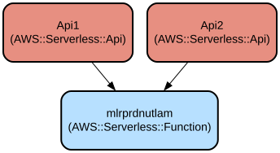

# Nutritional Value Calculator Lambda Function - Automated Dish Nutrition Analysis via AWS Bedrock

This project implements a serverless AWS Lambda function that calculates nutritional values for dishes based on ingredients and serving sizes. It leverages AWS Bedrock's Claude 3 Sonnet model to provide accurate nutritional calculations for five key nutrients: calories, carbohydrates, fats, proteins, and sodium.

The service processes ingredient lists and serving sizes through a REST API, utilizing AWS Bedrock's natural language processing capabilities to analyze and calculate nutritional content. The system is designed for scalability and reliability, with built-in error handling and Korean language support through UTF-8 encoding.

## Repository Structure
```
.
├── README.md                  # Project documentation
├── src/
│   └── lambda_function.py    # Main Lambda function implementation with Bedrock integration
└── template.yml              # AWS SAM template defining Lambda function and API Gateway
```

## Usage Instructions
### Prerequisites
- AWS Account with appropriate permissions
- AWS CLI installed and configured
- Python 3.12 or later
- AWS SAM CLI for deployment

### Installation

1. Clone the repository:
```bash
git clone <repository-url>
cd <repository-name>
```

2. Install AWS SAM CLI:
```bash
# macOS
brew tap aws/tap
brew install aws-sam-cli

# Linux
pip install aws-sam-cli

# Windows
choco install aws-sam-cli
```

3. Deploy the application:
```bash
sam build
sam deploy --guided
```

### Quick Start

1. Make a POST request to the API endpoint:
```bash
curl -X POST https://<api-gateway-url>/mlr-prd-nut \
-H "Content-Type: application/json" \
-d '{
    "ingredients": ["chicken breast 200g", "olive oil 15ml", "rice 150g"],
    "servings": 2
}'
```

2. The API will return nutritional values in the following format:
```json
{
    "칼로리": "450kcal",
    "탄수화물": "45g",
    "지방": "15g",
    "단백질": "35g",
    "나트륨": "125mg"
}
```

### More Detailed Examples

Calculate nutrition for a complex recipe:
```bash
curl -X POST https://<api-gateway-url>/mlr-prd-nut \
-H "Content-Type: application/json" \
-d '{
    "ingredients": [
        "salmon fillet 300g",
        "sweet potato 200g",
        "broccoli 150g",
        "butter 30g",
        "soy sauce 15ml"
    ],
    "servings": 3
}'
```

### Troubleshooting

Common Issues:

1. **API Gateway 500 Error**
   - Problem: Lambda function timeout
   - Solution: Check if the request is within the 15-second timeout limit
   - Debug: Enable CloudWatch logs and check for timeout errors

2. **Bedrock Model Access Issues**
   - Problem: "Access Denied" when calling Bedrock
   - Solution: Verify IAM roles and permissions
   - Check: Review the `BedrockAll` policy in template.yml

Debug Mode:
```python
import logging
logger = logging.getLogger()
logger.setLevel(logging.DEBUG)
```

## Data Flow
The system processes nutritional calculations through a series of transformations from raw ingredients to calculated values using AWS Bedrock's AI capabilities.

```ascii
[Client] -> [API Gateway] -> [Lambda] -> [Bedrock Runtime]
                                           |
[Client] <- [API Gateway] <- [Lambda] <- [Processed Response]
```

Key Component Interactions:
1. Client sends ingredients and servings via API Gateway
2. Lambda function formats the query for Bedrock
3. Bedrock processes the natural language query
4. Lambda function processes and formats the response
5. Results are returned through API Gateway to the client

## Infrastructure


AWS Resources defined in template.yml:

Lambda Function (mlrprdnutlam):
- Runtime: Python 3.12
- Memory: 128MB
- Timeout: 15 seconds
- Architecture: x86_64

API Gateway:
- Endpoints:
  - POST /mlr-prd-nut
  - ANY /MyResource

IAM Policies:
- Bedrock full access
- KMS key description
- VPC and security group access
- IAM role passing to Bedrock

## Deployment
Prerequisites:
- AWS SAM CLI
- AWS credentials configured

Deployment Steps:
1. Build the application:
```bash
sam build
```

2. Deploy to AWS:
```bash
sam deploy --guided
```

3. Configure environment:
```bash
aws configure
```

4. Verify deployment:
```bash
aws lambda list-functions | grep mlrprdnutlam
```